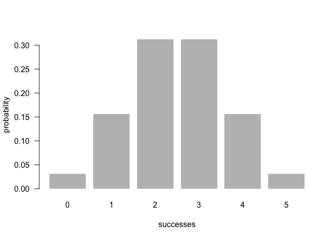

<!-- README.md is generated from README.Rmd. Please edit that file -->

## Overview

`"binomial"` is a minimal [R](http://www.r-project.org/) package that
provides functions for calculating probabilities of a Binomial random
variable, and related calculations such as the probability distribution,
the expected value, variance, mode, etc.

## Motivation

The creation of this package was used as a project assignment in one of
the editions of [Stat 133 Concepts in Computing with
Data](https://github.com/ucb-stat133). The main purpose of this
assignment was to illustrate some of the concepts behind the creation of
an R package.

## Installation

Install the development version from GitHub via the package
`"devtools"`:

``` r
# development version from GitHub:
install.packages("devtools") 

# install "binomial"
devtools::install_github("gastonstat/binomial")
```

## Usage

``` r
library(binomial)

# probability of getting 2 successes in 5 trials
# (assuming prob of success = 0.5)
bin_probability(success = 2, trials = 5, prob = 0.5)
#> [1] 0.3125

# probabilities of getting 2 or less successes in 5 trials
# (assuming prob of success = 0.5)
bin_probability(success = 0:2, trials = 5, prob = 0.5)
#> [1] 0.03125 0.15625 0.31250

# 55 heads in 100 tosses of a loaded coin with 45% chance of heads
bin_probability(success = 55, trials = 100, prob = 0.45)
#> [1] 0.01075277
```

``` r
 # binomial probability distribution
bin_distribution(trials = 5, prob = 0.5)
#>   success probability
#> 1       0     0.03125
#> 2       1     0.15625
#> 3       2     0.31250
#> 4       3     0.31250
#> 5       4     0.15625
#> 6       5     0.03125
```

``` r
# plotting binomial probability distribution
dis1 <- bin_distribution(trials = 5, prob = 0.5)
plot(dis1)
```

<!-- -->

``` r
 # binomial cumulative distribution
bin_cumulative(trials = 5, prob = 0.5)
#>   success probability cumulative
#> 1       0     0.03125    0.03125
#> 2       1     0.15625    0.18750
#> 3       2     0.31250    0.50000
#> 4       3     0.31250    0.81250
#> 5       4     0.15625    0.96875
#> 6       5     0.03125    1.00000
```

### Binomial Random Variable

The package `"binomial"` also has the function `bin_variable()` that
lets you create a binomial random variable. To be more precise, this
function returns an object of class `"binvar"`

``` r
# binomial variable
bin1 <- bin_variable(trials = 10, p = 0.3)
bin1
#> "Binomial variable"
#> 
#> Paramaters 
#> - number of trials: 10 
#> - prob of success : 0.3

# summary method
binsum1 <- summary(bin1)
binsum1
#> "Summary Binomial"
#> 
#> Paramaters 
#> - number of trials: 10 
#> - prob of success : 0.3 
#> 
#> Measures 
#> - mean    : 3 
#> - variance: 2.1 
#> - mode    : 3 
#> - skewness: 0.2760262 
#> - kurtosis: -0.1238095
```

### Summary Meausres

Finally, `"binomial"` has a couple of additional functions to compute
summary measures such as the mean, variance, kurtosis

``` r
# mean
bin_mean(10, 0.3)
#> [1] 3

# variance
bin_variance(10, 0.3)
#> [1] 2.1

# mode
bin_mode(10, 0.3)
#> [1] 3

# skewness
bin_skewness(10, 0.3)
#> [1] 0.2760262

# kurtosis
bin_kurtosis(10, 0.3)
#> [1] -0.1238095
```
